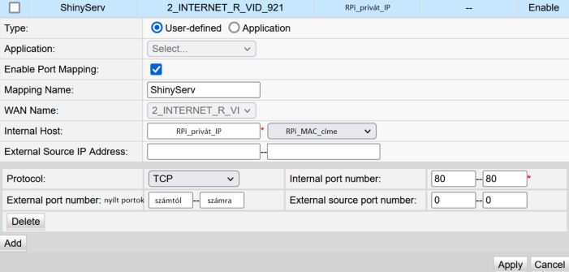

# Table of contents

1. Abstract
2. Introduction
	1. Purpose of research
	2. Tools and methodology
		- The Rapsberry Pi (RPi)
		- Ansible
		- The study of Enzyme kinetics
3. Project process
	1. RPi preparation
		- OS installation
		- SSH and/or VNC
	2. RStudio and Shiny Server
		- Installation
		- General information
	3. PMM - Pi Michaelis Menten
		- Development
		- Deployment
	4. Security measures
4. Possible problems and their solutions
5. Results
6. Discussion
7. Conclusion

\newpage

# Abstract

In this dissertation, I examine whether (1) if it's possible to use the Raspberry Pi, a palm-sized computer, as the host for a web application (WebApp), developed in the RStudio IDE, that can compute complex mathematical formulas in real-time, in our case: the well-known Michaelis-Menten model, which is widely used in the study of enzyme kinetics; and (2) with the help of the Shiny framework to develop a user-friendly interface and host the WebApp, henceforth called Pi Michaelis-Menten or PMM for short, on a local area network (LAN) or futhermore, to deploy it to the internet (WAN).

# Introduction

## Purpose of research

The world is advancing rapidly into the digital space, making it's a necessary to develop futher our servers and databases for world wide uses. Thereby, I suggest that the RPi will be able to perform these two tasks exceptionally well, and is an affordable, easy-to-use solution for web hosting and sharing projects, especially for personal uses.

To demonstrate its capabilities, I chose to build a web application written in R language, that utilizes the Michaelis-Menten model, calculating the speed of an enzyme reaction with different parameters. The results will then be presented in graph-base, thus making it easier for us to interpret.

To summarize, the research has two main goals, which are:
- firstly, if the Raspberry Pi is sufficient for real-time computation of complex mathematical formulas, in our case the Michaelis-Menten model.
- secondly, to build a user-friendly interface that allows modification of input data for the Michaelis-Menten model. The model's results will then be presented in the form of graphs for easier interpretation.

## Tools and methodology

### The Raspberry Pi (RPi)

#### Brief history

The palm-sized computere known as the Raspberry Pi is an invention of four professors at Cambridge University in England. Those four professors were: Eben Upton, Rob Mullins, Jack Lang and Alan Mycroft.
The idea came to be when the Professors noticed a decrease in skill and number of A-level students who wanted to study Computer Science / Informatics. Then they discovered that this was because home computers had become more and more expensive, which made parents not allowing their children to experiment with them. So the Professors wanted to look for an affordable solution that would allow the younger generation to experiment with computers at home.
By 2011, the first model of the Raspberry Pi was available to the public, with more than 2 million units sold in the first two years.

\pagebreak

#### About my 4B model

- Overall specifications:
	- CPU: Broadcom BCM2711, Quad core Cortex-A72 (ARM v8) 64-bit SoC @ 1.5GHz
	- PSU: 5V DC via USB-C connector, adapter: 
	- RAM: 4GB of LPDDR4-3200 SDRAM
	- ROM: micro-SD card slot
	- Network:
		- 2.4 GHz and 5.0 GHz IEEE 802.11ac wireless
		- Bluetooth 5.0, BLE
		- Gigabit Ethernet
	- Ports: 2-2 USB 3.0 and 2.0 ports; 2 micro-HDMI; etc.
	- GPIO pins
	- OS: Raspberry Pi OS (buster), previously known as Raspbian

- Things that are crucial to the project:
	- consistent internet connection, especially so if running with "Headless" mode (using the RPi without any peripherals like mouse or monitor)

- Things that are recommended to have:
	- at least 4GB of RAM
	- cooling fan

**I mostly control my RPi through SSH/terminal so this dissertation focuses mainly on the command-line when it comes to installing, editing files etc. For GUI instruction, it's highely advised to read over the cited documentation sources**

\pagebreak

### Enzyme Kinetics

#### Brief introduction

Enzyme kinetics is the study of the rates of enzyme-catalysed chemical reactions, the reaction rate is measured and the effects of varying the conditions of the reaction are investigated.
Studying an enzyme's kinetics in this way can reveal the catalytic mechanism of this enzyme, its role in the metobolism, how its activity is controlled, and how a drug or a modier might affect the rate.

An enzyme (E) is typically a protein molecule that promotes a reaction of another molecule, its substrate (S). This binds to the active site of the enzyme to produce an enzyme-substrate complex ES, and is transformed into an enzyme-product complex EP and from there to product P, via a transition state ES\*.
The series of steps is known as the mechanism:

> E + S -> ES -> ES\* -> EP -> E + P


#### Single-substrate reactions and the Michaelis-Menten model

Enzymes with single-substrate mechanisms include isomerases such as *triosephosphateisomerase* or *bisphosphoglycerate mutase*, intramolecular lyases such as *adenylate cyclase* and the *hammerhead ribozyme*, an RNA lyase.
Biochemical reactions invovling a single-substrate enzyme are often assumed to follow Michaelis-Menten kinetics, regardless of the underlying assumptions of the model.

In biochemistry, Michaelis-Menten kinetics is one of the best-known modles of enzyme kinetics. It is named after German biochemist *Leonor Michaelis* and Canadian physician *Maud Menten*.
The model takes the form of an equation describing the rate of enzymatic reations, by relating reaction rate *v* (rate of formation of product *[P]*) to *[S]*, the concentration of a substrate *S*. Its formula is given by:

> v = d[P]/dt = Vmax * [S]/(KM + [S])

The above equation is called **Michaelis-Menten equation**. Here, *Vmax* represents the maximum rate achieved by the system, happening at saturating substrate concentration for a given enzyme concentration. When the value of the Michaelis constant *KM* is numerically equal to the substrate concentration, then the reaction rate is half of *Vmax*.


\newpage


# Project process

## RPi preparation

The official documentation is well-written and will help you with almost any FAQ: [Raspberry Pi Documentation](https://www.raspberrypi.com/documentation/). My steps below are mostly identical, and is just a paraphrase of mine from the documentation.

! It's a good practice to run `sudo apt update & sudo apt upgrade` once in awhile, and before installing a new package.

### OS installation

Download the [Raspberry Pi Imager](https://www.raspberrypi.com/software/)

Before flashing the OS image to the SD card, considering if you need to use *Headless mode* - controlling the RPi without mouse or monitor.

### Headless: SSH and/or VNC

#### Getting your RPi's private IP

To find your RPi's private IP address, either login to your router's dashboard and check the DHCP tab or by using *nmap* - [network exploration tool](https://manpages.ubuntu.com/manpages/bionic/en/man1/nmap.1.html):
``` bash
$ nmap -A <your_subnet_IP>/24
```
The -A flag/option will output a lot of extra information, you need to look for the following lines


Another cli tool is *ping* which is simpler to use than the *nmap* approach, but it didn't work for me:
``` bash
$ ping raspberrypi.local
```

#### Using SSH - CLI way

To first enable SSH, either take a look at the "Advanced" tab (can be accessed by pressing *Ctrl+Shift+x* or using GUI) in the Raspberry Pi Imager and tick the box for Headless mode, or after flashing the OS image, add a no-extension *ssh* named file into the SD's *bootup/* folder.

For internet connection, either use an Ethernet cable or add a file named *wpa_supplicant.conf* into the *bootup/* folder. The content of the file is as followed:

``` bash
ctrl_interface=DIR=/var/run/wpa_supplicant
GROUP = netdev
update_config = 1
network = {
	ssid = "<your_wifi_name"
	psk = "<wifi_password>"
	key_mgmt = WPA-PSK
	# key_mgmt can be varied, but it's usually safe to assume as so
}
```

To connect to your RPi, use:
``` bash
$ ssh pi@<RPi_private_PI>
```
We'll be using the password to login for now, and will later on change to the "SSH key pair" method.

#### Using VNC - GUI way

*Eventhough the VNC service is now pre-installed within the OS image, for a RPi running fully in Headless mode, you will still need to first enable SSH to be able to initially configure the VNC*

"VNC is a graphical desktop sharing system that allows you to remotely control the desktop interface of one computer (running VNC Server) from another computer or mobile device (running VNC Viewer). VNC Viewer transmits the keyboard and either mouse or touch events to VNC Server, and receives updates to the screen in return."

I chose to use [RealVNC](https://www.realvnc.com/en/connect/home/) for their free home-plan. There are two applicaitons that need to be installed: the [VNC Server](https://www.realvnc.com/en/connect/download/vnc/) for your RPi, and the [VNC Viewer](https://www.realvnc.com/en/connect/download/viewer/") for you laptop/pc to control the RPi.

It's possible to either download the *VNC Viewer* on your host then send the installation file through *scp* - [secure copy](https://manpages.ubuntu.com/manpages/bionic/en/man1/scp.1.html) command, or ssh into your RPi and do:
``` bash
$ sudo apt update
$ sudo apt install realvnc-vnc-server
```
After the installation, to enable *vnc-server* to start on bootup
``` bash
$ sudo systemctl enable vncserver-virtuald.service
```
Mind you, this will not run the program until the next bootup, to run it for this session, use:
``` bash
$ sudo systemctl start vncserver-virtuald.service
```

To connect to your RPi: [Establishing a cloud connection](https://www.raspberrypi.com/documentation/computers/remote-access.html#establishing-a-cloud-connection)


\newpage


## RStudio and Shiny Server

### Installation

Andres' Blog: [Automatically installing Shiny and RStudio server on Raspberry Pi OS (32 and 64 bits) with Ansible](https://andresrcs.rbind.io/2021/01/13/raspberry_pi_server/)

Here's a quick rundown of the process:

- Preparing the RPi:

	- Basic configurations by using `$ sudo raspi-config` and do:


		- change the default password of the user "pi":
			System Options/Password
		- enable the SSH, which has already been done for the Headless mode:
			Interface Options/SSH
		- reduce GPU memory to 16MB:
			Performance Options -> GPU memory
		- set locale settins:
			Localization Options
		- expand the filesystem to use the full capacity of the SD card:
			Advanced Options -> Expand Filesystem
		- disable [Predictable Network Interface Names](https://www.freedesktop.org/wiki/Software/systemd/PredictableNetworkInterfaceNames/):
			Advanced Options -> Network Interface Names
		- exit the *raspi-config* tool and reboot:
``` bash
$ sudo reboot now
```

\pagebreak

- Create the .ssh/authorized_keys file on your RPi
``` bash
# Create the .ssh folder
cd ~
mkdir .ssh
# Create the authorized_keys file in the .ssh/
touch .ssh/authorized_keys

# Set proper access permissions
chmod 700 ~/.ssh
chmod 600 ~/.ssh/authorized_keys
```

- Create the SSH key pair on your host machine
``` bash
# Check for existing key pair: id_rsa and id_rsa.pub
# id_rsa.pub's content will be sent to other machines
# !! id_rsa is to be kept on your machine only
$ cd ~/.ssh && ls

# Create the key pair, you can just save it in the default location ~/.ssh/
$ cd ~
$ ssh-keygen

# Append the id_rsa.pub to your RPi's ~/.ssh/authorized_keys
$ ssh-copy-id pi@<RPi_private_IP>
# Authenticate the process with your pi user's password
```

- Installing Ansible

	- What is Ansible? "An Ansible playbook is a blueprint of automation tasks - which are complex IT actions executed with limited or no human involvement. Ansible playbooks are essentilaly frameworks, which are prewritten code that developers can use ad-hoc or as starting template."

	- It's possible to install Ansible directly on your RPi, but it isn't practical by doing so, since one of the benefits when using Ansible is the repeatability of it.
		For example if somehow your SD card gets "bricked" and you have to start over, this step and the one after can be re-ran right away.
	
	- On a Linux machine, for example Ubuntu:
``` bash
# Install pip3
$ sudo apt install python3-pip
# Install Ansible version 5.2.0 (for reproducibility) with pip3
$ sudo pip3 install ansible==5.2.0
```

	- For Windows, Ansible isn't supported natively, so you must use WSL ([Windows Subsystem for Linux](https://docs.microsoft.com/en-us/windows/wsl/install))

\pagebreak	

	- Configuring "keep-alive" packets sending for SSH: to avoid the connection being closed due to inactivity and risk of disrupting Ansible
		Editing the */etc/ssh/ssh_config* file
``` bash
# Look for the 'Host *' line then add under it
ServerAliveInterval 300
ServerAliveCountMax 2
```

- Download and configure the Playbooks

	- Clone/Download from Andres's GitHub
``` bash
# If you don't have git installed
$ sudo apt install git
# Clone the repo
$ git clone https://github.com/andresrcs/raspberry_pi_server.git --depth 1
```

	- Define the "inventory" - the list of hosts to be connected to:
		edit the *raspberry_pi_server/inventory.ini* file and add the IP of your RPi(s):
``` bash
# This represents a group of Raspberries
[raspberries]
# This is the hostname and IP for an individual Raspberry Pi
# You can add as many Raspberries as you need
raspberry_01 ansible_host=192.168.0.10
```

	- Set common variables for your `[raspberries]` group:
		edit the *rasberry_pi_server/group_vars/raspberries.yml* file, pay attention to the path to the ssh key
``` bash
# The default user for RPi is 'pi', change if needed
ansible_user: pi
ansible_become_method: sudo
ansible_python_interpreter: /usr/bin/python3
# The location of the ssh key in your local host
ansible_ssh_private_key_file: ~/.ssh/raspberrypi_key
```

	- Review the installation settings, the most important ones to look over are:
	``` bash
	# Disable WiFi interface?
	disable_wifi: false
	
	# Notification email for fail2ban
	send_email: true
	fail2ban_email: your_email@something.com
	
	# Password for the main PostgreSQL user
	postgres_password: 'very_secure_password'
	```

\pagebreak

- Run the Playbooks

	- the files to be executed are
	``` bash
	# running everything at once
	main.yml

	# runnig separately
	install_basic_services.yml
	install_shiny_server.yml
	install_rstudio_server.yml
	```


	- It is recommended to run them separately, since the whole installation process can take up to 6 hours, and will be easier for troubleshooting. The command to used is
	``` bash
	$ ansible-playbook <playbook>
	```

	- For a more specific use cases of the playbooks, there are ["tags"](https://andresrcs.rbind.io/2021/01/13/raspberry_pi_server/#run-the-playbooks) to run only part of the playbooks, such as
	``` bash
	# 'r' for the actual tag's name
	$ ansible-playbook install_basic_services.yml --tags "r"
	```

- After the playbooks finish running, you should now have a functional RStudio + Shiny Server on your RPi, access them through:
	- http://RPi_private_IP/rstudio for RStudio session, or enter in the terminal the command: `$ R`
	- http://RPi_private_IP/shiny/app_name to access your shiny apps, source code files are to be kept in */srv/shiny-server/app_name/* folder.


\newpage


## PMM

### Brief introduction

### Development

### Security measures

### Deployment

#### Port Forwarding

This function is varied from manufactures to manufactures and also depending on their models, but the overall settings won't be too much of a difference from the following:



#### DDNS service - NoIP


\newpage


# Possible problems and their solutions


\newpage


# Results


\newpage


# Dicussion


\newpage


# Conclusion
